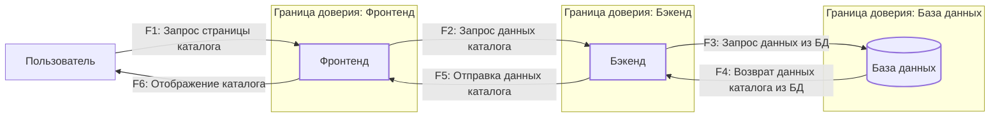

# DFD

## Описание компонентов:
1.  **Пользователь** (Внешняя сущность): Инициирует взаимодействие с сервисом через Фронтенд.
2.  **Фронтенд** (Процесс): Клиентское веб-приложение, отвечающее за отображение каталога и взаимодействие с Бэкендом.
3.  **Бэкенд** (Процесс): Основной серверный компонент, обрабатывающий запросы от Фронтенда, содержащий бизнес-логику и взаимодействующий с Базой данных.
4.  **База данных (PostgreSQL/SQLAlchemy)** (Хранилище данных): Содержит всю информацию о фильмах и курсах.

## Потоки данных:

*   **F1: Запрос страницы каталога** (Пользователь -> Фронтенд)
    *   Пользователь в браузере запрашивает URL сервиса, чтобы увидеть каталог.
*   **F2: Запрос данных каталога** (Фронтенд -> Бэкенд)
    *   После загрузки страницы, Фронтенд отправляет AJAX-запрос к Бэкенду для получения списка фильмов/курсов.
*   **F3: Запрос данных из БД** (Бэкенд -> База данных)
    *   Бэкенд выполняет SQL-запрос к Базе данных для получения необходимой информации.
*   **F4: Возврат данных каталога из БД** (База данных -> Бэкенд)
    *   База данных возвращает результат запроса Бэкенду.
*   **F5: Отправка данных каталога** (Бэкенд -> Фронтенд)
    *   Бэкенд формирует JSON-ответ с данными каталога и отправляет его Фронтенду.
*   **F6: Отображение каталога** (Фронтенд -> Пользователь)
    *   Фронтенд парсит полученные данные и отображает их пользователю в удобном виде.

